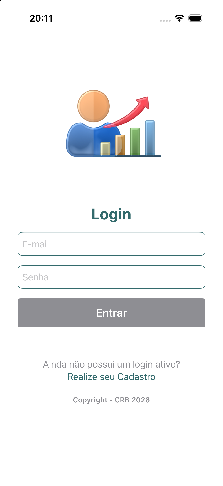
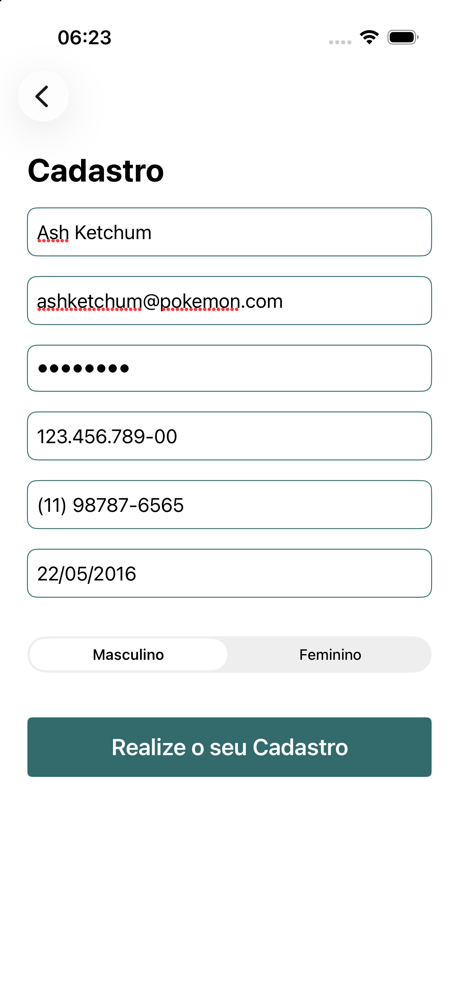
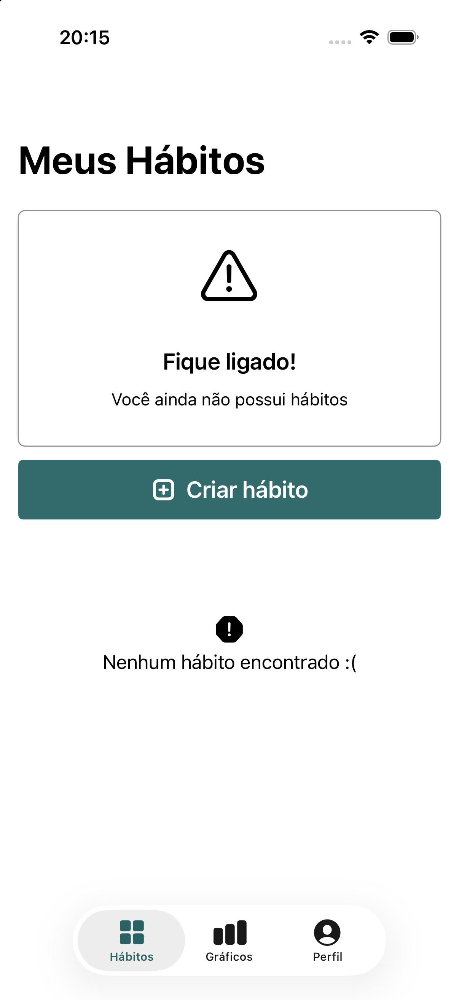
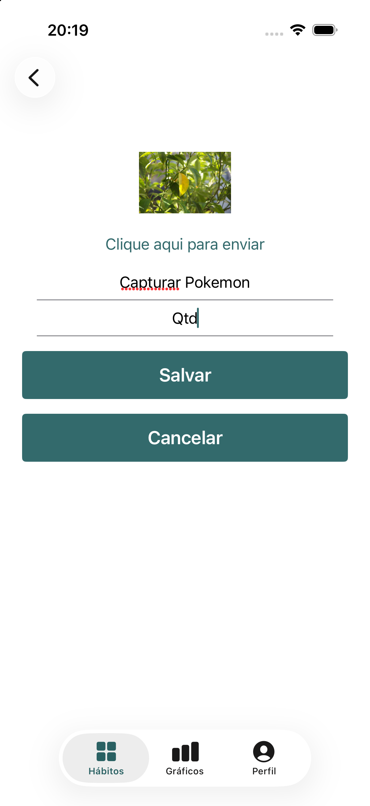
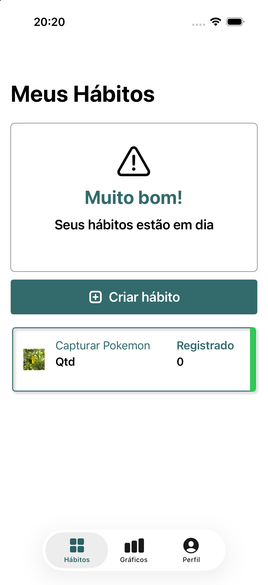
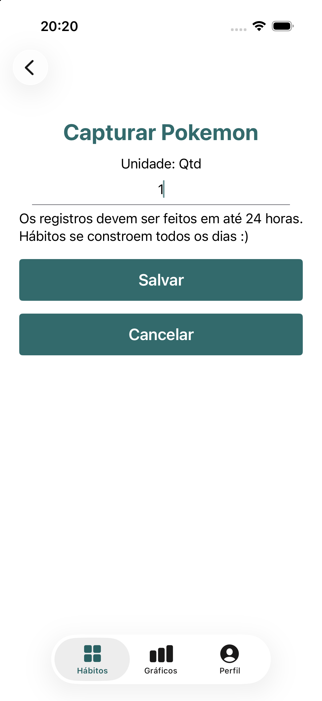
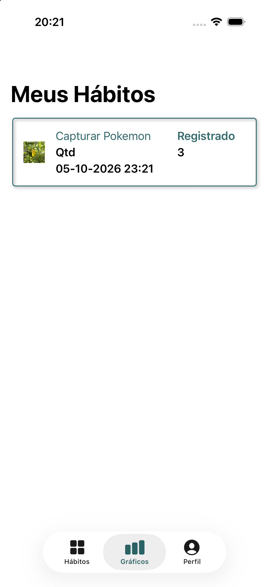
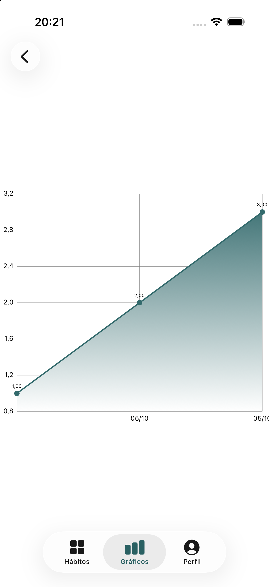
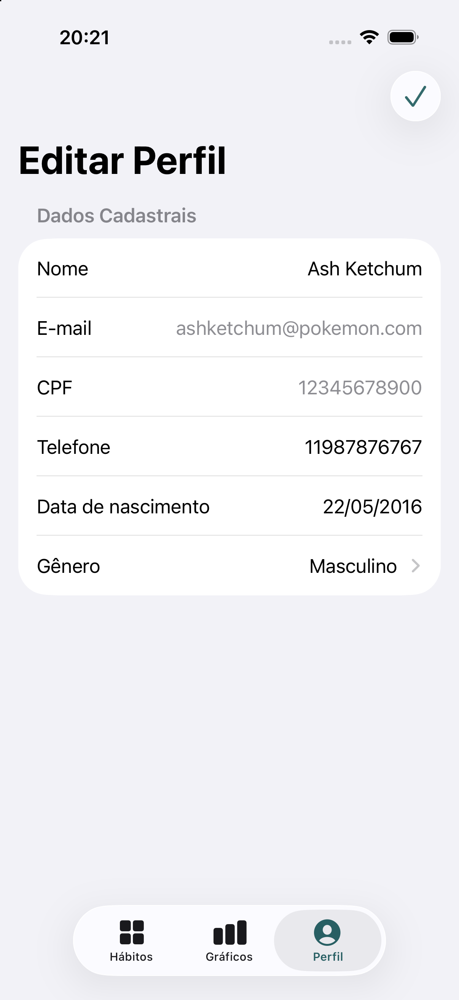
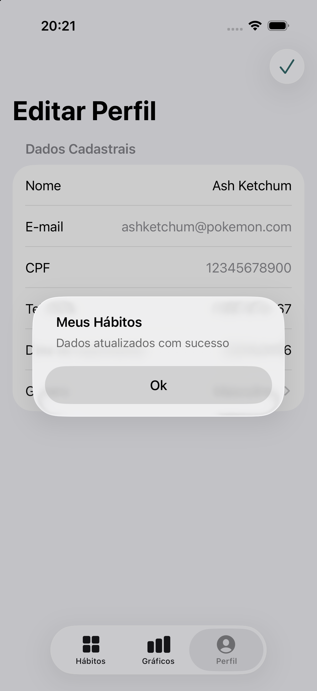

# Meus Hábitos

Aplicativo iOS desenvolvido em **Swift e SwiftUI** para gerenciamento e acompanhamento de hábitos diários.

O projeto faz parte dos meus estudos em **Desenvolvimento iOS**, com foco na aplicação prática de conceitos de desenvolvimento de aplicativos para o ecossistema Apple.

## Sobre o projeto

O Meus Hábitos foi desenvolvido com o objetivo de criar uma aplicação simples e intuitiva para auxiliar o usuário no acompanhamento de seus hábitos.

Durante o desenvolvimento, são aplicados conceitos de:

- Desenvolvimento de interfaces com SwiftUI
- Persistência de dados
- Consumo de APIs REST
- Arquitetura MVVM
- Navegação entre telas
- Gerenciamento de estado
- Organização e reutilização de componentes
- Controle de versão com Git e GitHub

## Funcionalidades

- Cadastro de perfil
- Edição de perfil
- Cadastro de novos hábitos
- Visualização dos hábitos
- Acompanhamento dos hábitos por meio de gráficos

## Tecnologias utilizadas

- Swift
- SwiftUI
- REST API
- MVVM
- Xcode
- Git
- GitHub

## Dependências e ferramentas

- CocoaPods
- Charts

## Arquitetura

O projeto utiliza o padrão **MVVM (Model-View-ViewModel)**, buscando separar as responsabilidades da aplicação e facilitar sua manutenção e evolução.

## Screenshots

### Autenticação

  
  

### Hábitos

  
  
  

### Acompanhamento

  
  
  

### Perfil

  
  

## Requisitos

- iOS 15.6 ou superior

## Objetivos de aprendizagem

Este projeto tem como objetivo consolidar conhecimentos em desenvolvimento iOS, especialmente:

- Swift e SwiftUI
- Arquitetura MVVM
- Consumo de APIs
- Navegação e gerenciamento de estado
- Organização de projetos iOS
- Git e GitHub
- Boas práticas de desenvolvimento

## Autor

**Cristiano Borges**
Desenvolvedor iOS

- GitHub: [@crborges86](https://github.com/crborges86)
- LinkedIn: [Cristiano Borges](https://www.linkedin.com/in/borgescristiano)